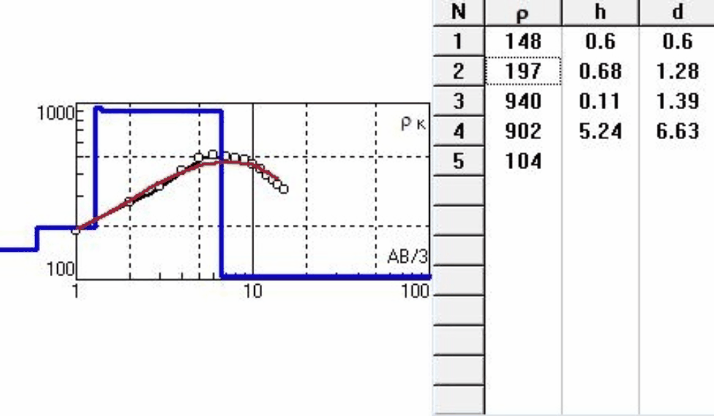
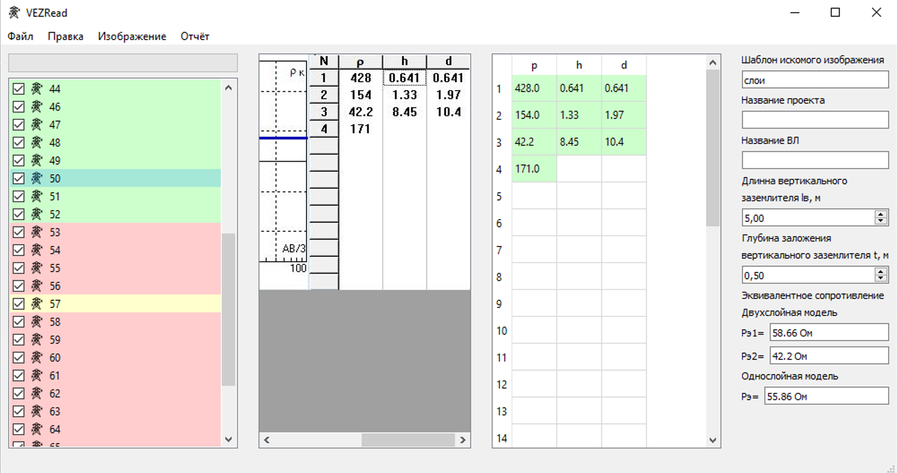
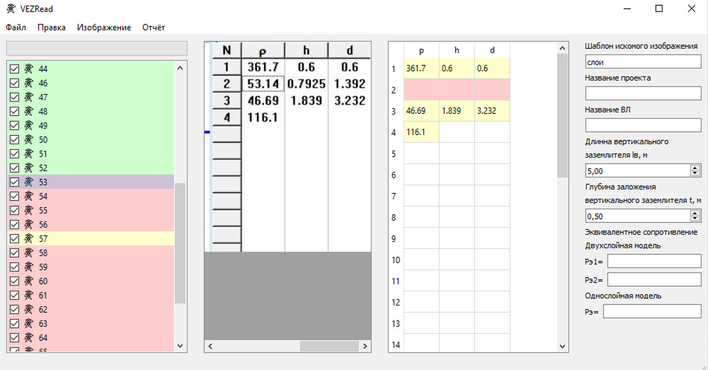

# VEZRead

## Scope of application 

**VEZRead** - desktop application, designed for reading images with results of vertical electrical sounding and next transform of results for creating special documentation. 

## Table of contents

  1. [Description](#Description)
  2. [Used technologies](#Used-technologies)
  3. [Installation](#Installation)
  4. [License](#License)

## Description

As we need to process a lot of results of VES, manual processing those results spends much time. It was main reason developing application that realizes reading of images with results of VES automatically, that makes next work with them easier.

Results of VES are given by images, which have plot on the left and table on the right. We need only table. Almost always table has fixed font size and cell shape. These factors have helped to create simple algorithm machine reading for this task.

Algorithm machine reading works the next way. For work with images is using [Pillow](https://pypi.org/project/Pillow/8.1.1/) library. First of all transform colored image into black and white image which have to consist of only two colors: white and black. Then starting from the top right edge in the direction the bottom look for horizontal line table head by way checking that pixels have black color. Found that line move along it to the left to definite vertical line of table's left edge, also saving lines coordinates that separating columns of table. Found vertical line of table edge start to move along it to the bottom for finding of lines separating rows of table. Now it is had all necessary coordinates for cell extraction from table using [Pillow](https://pypi.org/project/Pillow/8.1.1/) library. In order to understand that cell not empty check that cell image has pixels black color. For reading data from cells are used two ways. Firs way is realized by slice comparisons of cell image with template using [Numpy](https://pypi.org/project/numpy/1.15.0/) library, and if template and  slice are same, so save it and next slices get from place of the end previous. Second way is realized by image analyze using [Tesseract OCR](https://digi.bib.uni-mannheim.de/tesseract/). Using two ways is explained that firs has 100% accuracy, but if reading was failed, so using second way that has less accuracy and spends more time, but has more difficult image reading algorithms.

Application has GUI that has been developed with [PyQt5](https://pypi.org/project/PyQt5/5.9/) library. Application window has 4 parts: widget for showing list of VES, widget for showing VES image, widget for showing resuts of reading, widget for additional settings.

For showing successfully of VES images reading is using color indication of VES list and table cells with results of VES. Green color means successful reading.

Yellow color means that reading was successful only with [Tesseract OCR](https://digi.bib.uni-mannheim.de/tesseract/), and results require checking by operator. Red color means unsuccessful reading and data has to be entered with hand.

Manual input of information is easy enough, since necessary part of image already show in application window. Also fourth widget have area that shows results transform multilayer soil model, that has been read from VES image, to two-layer and single-layer model.
 
Type of data loading depends on structure of data. There are opportunities for loading single images, images packs and images directory.

Data saving is realized by way writing it into .xlsx files with [Openpyxl](https://pypi.org/project/openpyxl/2.4.8/) library, that gives oppotunities comfortable work with it in MS Excel. Also there is opportunity to generate special .docx document using results of VES reading with [Python-docx](https://pypi.org/project/python-docx/0.8.6/) and [Docxtpl](https://pypi.org/project/docxtpl/0.3.9/) libraries, that is convinient to send it to other people. 

## Used technologies

- [Python 3.6.2](https://www.python.org/downloads/) - Python programming language interpreter.
- [Tesseract OCR 4.1.0](https://digi.bib.uni-mannheim.de/tesseract/) - free computer program of optical character recognition.
- [Pytesseract 0.3.6](https://pypi.org/project/pytesseract/0.3.6/) - Python library that use Tesseract OCR for recognizing and “reading” the text embedded in images. 
- [Numpy 1.15.0](https://pypi.org/project/numpy/1.15.0/) - general-purpose array-processing package designed to efficiently manipulate large multi-dimensional arrays of arbitrary records without sacrificing too much speed for small multi-dimensional arrays.
- [PyQt5 5.9](https://pypi.org/project/PyQt5/5.9/) - Python binding of the cross-platform GUI toolkit Qt, implemented as a Python plug-in.
- [Pillow 8.1.1](https://pypi.org/project/Pillow/8.1.1/) - the Python Imaging Library.
- [Openpyxl 2.4.8](https://pypi.org/project/openpyxl/2.4.8/) - Python library to read/write Excel 2010 xlsx/xlsm/xltx/xltm files.
- [Python-docx 0.8.6](https://pypi.org/project/python-docx/0.8.6/) - Python library for creating and updating Microsoft Word (.docx) files.
- [Docxtpl 0.3.9](https://pypi.org/project/docxtpl/0.3.9/) - Python library for filling templates (.docx) files.

## Installation 

For using the application necessity to install components from section [Used technologies](#Used-technologies). First of all install Python interpreter and Tesseract OCR, and after that using package manager *Pip* to install listed packages. In case using versions of packages that differ from the proposed, correct work of the application is not ensured.

        pip install -r requirements.txt

## License 
Licensed under the [MIT](LICENSE.txt) license.	

